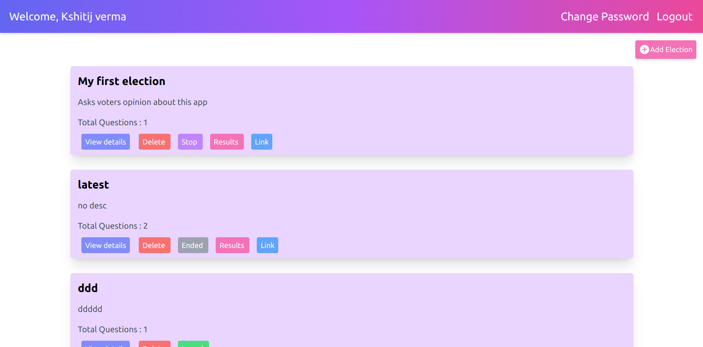

# Voting-App

This a simple, easy to use and open source online voting platform where you can host polls and elections.

## Features

- Built with Node.js
- Easy to use
- Free to use / Open source
- Simple navigation
- Proper authentication
- Can run multiple election at once
- Provide a publicly accessible url for voters
- See the live election status on results page
- Can be used on multiple screens

## Screens

#### Login Page

#### Dashboard

#### Add Election Page

#### Election Ballot

#### Results Page

## Use It

#### 👉 [Try it out](https://voting-app-by-kshitij.onrender.com)

#### 👉 [Demo Video](https://www.loom.com/share/d6cc7903f34d440b85781c9f52ee3419)
